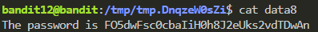
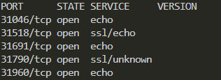
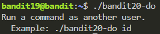

# Bandit

ssh -p 2220 bandit@bandit.labs.overthewire.org

### Level 0 > 1
Connexion : 

```ssh bandit0@bandit.labs.overthewire.org -p 2220```

**Solution** : ```cat readme```

Mot de passe bandit1 : ZjLjTmM6FvvyRnrb2rfNWOZOTa6ip5If

### Level 1 > 2

```ssh bandit1@bandit.labs.overthewire.org -p 2220```

Le niveau deux, est un peu tricky, le mot de passe se trouve dans un fichier avec comme nom (-), ce qui fait qu'on ne peut pas utilisé cat, du fait que cette dernière attend un paramètre après le dash (-).

Pour résoudre ce problème vous avez plusieurs approches, la première et la plus rapide, consiste à utiliser la commande ```more```

L'autre solution, c'est l'utilisation de la commande ```cat``` mais en indiquant le chemin absolu
```cat ./-```

**Solution** : ```cat ./-```

Mot de passe bandit2 : 263JGJPfgU6LtdEvgfWU1XP5yac29mFx

### Level 2 > 3

```ssh bandit2@bandit.labs.overthewire.org -p 2220```

Toujours dans la même la logique que le précédent, sauf que cette fois il y à des espaces qui rajoute une difficulté.

Si vous avez pratiquer un peu de scripting ou de programmation vous connaissez certainement le principe du double quote "" pour contenir un string. Eh bien on va utiliser cette méthode combiner à un chemin absolu pour résoudre le challenge.

**Solution** : ```cat ./"--spaces in this filename--"```

Si on veut travailler avec le chemin relatif (valable pour la précédente), on peut utiliser la commande ```cat -- "--spaces in this filename--"``` *On utilise le double dash ```--``` pour indiquier la fin d’options*

Mot de passe bandit3 : MNk8KNH3Usiio41PRUEoDFPqfxLPlSmx


### Level 3 > 4

```ssh bandit3@bandit.labs.overthewire.org -p 2220```

Dans ce challenge, nous avons affaire à un fichier caché dans le répertoire inhere.
Les fichiers cachés sont plus au moins fréquents sous Linux : tout nom de fichier qui commence par un . (point) n’apparaît pas dans un simple ls.
On les retrouve par exemple dans les répertoires personnels (comme .bashrc, .ssh/, .config/)...


Pour afficher les fichiers cachés, on utilise la commande ls avec le paramètre -a :

- ```-a``` = all files (inclut les fichiers cachés qui commencent par .)

**Solution** :

```ls -a inhere```

On remarque alors la présence d’un fichier caché nommé  ```...Hiding-From-You```

Il ne reste plus qu’à lire son contenu pour obtenir le mot de passe :

```cat inhere/...Hiding-From-You```

Mot de passe bandit4 : 2WmrDFRmJIq3IPxneAaMGhap0pFhF3NJ

### Level 4 > 5
```ssh bandit4@bandit.labs.overthewire.org -p 2220```

Le répertoire inhere contient plusieurs fichiers aux noms un peu particuliers.
Ils ne sont pas tous du même type : la majorité sont des fichiers binaires donc illisibles pour un être humain.
Cependant, un seul de ces fichiers est en ASCII text, donc lisible.

Bien sûr, vous pourriez tester manuellement avec :

 ```cat -- inhere/-file00 inhere/-file01 ...``` 
 
Cela fonctionnerait, mais ce serait fastidieux. Le but ici est justement de découvrir et d’utiliser de nouvelles commandes qui facilitent la vie.

**Solution** :

Pour résoudre ce challenge, on procède en deux étapes :

Identifier le fichier lisible par un humain avec :
```file ./inhere/*```

On remarque alors la présence d’un fichier de type ```ASCII text```, et il ne reste plus qu’à lire son contenu pour obtenir le mot de passe :

```cat -- ./inhere/-file07```

Mot de passe bandit5 : 4oQYVPkxZOOEOO5pTW81FB8j8lxXGUQw

### Level 5 > 6
```ssh bandit5@bandit.labs.overthewire.org -p 2220```

Le mot de passe du prochain niveau est caché quelque part dans le répertoire inhere, et pour ne pas nous faciliter la tâche il y a une vingtaine de répertoires, et chacun peut potentiellement abriter le fichier recherché.

Ce fameux fichier à trouver possède les caractéristiques suivantes :
- Il est lisible par un humain.
- Sa taille est exactement 1033 octets.
- Il n’est pas exécutable.

Vous avez envie de parcourir chaque dossier, ouvrir chaque fichier et vérifier manuellement ?
Avant de perdre au moins une heure de votre vie, essayez plutôt la commande :
```ls -lR inhere```

Vous réaliserez alors l’ampleur de la tâche... et pourquoi il faut absolument simplifier la recherche.


**Solution** :

Dans ce type de scénario, la commande find est votre meilleure alliée.
Elle permet de combiner plusieurs critères (type, taille, permissions…) pour cibler très rapidement le bon fichier selon les critères qu'on possède.
Voici la commande magique :

```find inhere -type f -size 1033c ! -executable```

**Décomposition**

- ```find inhere``` : parcourt récursivement tout le répertoire inhere.

- ```-type f``` : premier filtre → on ne garde que les fichiers (pas les répertoires).

- ```-size 1033c``` : second filtre → on ne garde que les fichiers dont la taille est exactement 1033 octets (c = bytes).

- ```! -executable``` : troisième filtre → on exclut tous les fichiers exécutables.

Une fois le fichier trouvé on exécute la commande : 

```cat inhere/maybehere07/.file2```

Mot de passe bandit6 : HWasnPhtq9AVKe0dmk45nxy20cvUa6EG

**## Level 6 > 7**

```ssh bandit6@bandit.labs.overthewire.org -p 2220```

Le mot de passe du prochain niveau n’est pas dans un dossier bien identifié cette fois-ci : il est caché quelque part sur tout le serveur.
Et pour corser l’affaire, le fichier à trouver n’est pas unique par son nom, mais par ses propriétés :

- Il est possédé par l’utilisateur bandit7.
- Il est possédé par le groupe bandit6.
- Sa taille est exactement 33 octets.

Autrement dit, si vous comptez fouiller chaque répertoire à la main avec ls, vous n'avez pas fini ta soirée. Il faut donc une méthode rapide et intelligente.

### Solution

On va réutiliser la commande ```find```, mais cette fois ci on va la combiner avec d'autres conditions (taille, propiétaire, groupe,...)

```find / -user bandit7 -group bandit6 -size 33c 2>/dev/null```

**Décomposition**

- ```find /``` : lance la recherche à partir de la racine /, donc sur tout le système.

- ```-user bandit7``` : filtre → fichiers appartenant à l’utilisateur bandit7.

- ```-group bandit6``` : filtre → fichiers appartenant au groupe bandit6.

- ```-size 33c``` : filtre → fichiers dont la taille est exactement 33 octets (c = bytes).

- ```2>/dev/null``` : redirige les erreurs (permissions refusées) vers /dev/null pour ne pas polluer l’affichage, elle affichera uniquement si le fichier est trouvé.

Une fois le fichier identifié, il suffit de lire son contenu avec cat :

```cat /var/lib/dpkg/info/bandit7.password```

Mot de passe bandit7 : morbNTDkSW6jIlUc0ymOdMaLnOlFVAaj


**## Level 7 > 8**

```ssh bandit7@bandit.labs.overthewire.org -p 2220```

Cette fois, pas besoin de fouiller tout le serveur, le challenge nous dit simplement :

👉 Le mot de passe du prochain niveau est stocké dans le fichier ```data.txt```, juste à côté du mot ```millionth```.

Autrement dit, quelque part dans le fichier ```data.txt```, une ligne contient ce mot-clé et juste après le mot ```millionth``` se trouve le précieux sésame.

### Solution

Ici, pas besoin de réinventer la roue. La commande grep est parfaite pour rechercher un mot précis dans un fichier.

```grep millionth .data.txt```

Mot de passe bandit8 : dfwvzFQi4mU0wfNbFOe9RoWskMLg7eEc

## Level 8 > 9

Cette fois, le challenge est un peu plus subtil.
Le mot de passe du prochain niveau est caché dans le fichier data.txt… mais il n’est pas marqué par un mot-clé particulier.

La consigne dit simplement :

Le mot de passe est la seule ligne du fichier qui apparaît une seule fois.
Toutes les autres lignes apparaissent plusieurs fois.

On doit donc :

1. Trier le fichier (pour que les doublons soient regroupés).
2. Identifier la ligne unique (qui apparaît une seule fois).

### Solution

C’est typiquement un cas où ```sort``` et ```uniq``` font le job, et on peut enchaîner les commandes grâce aux pipes (|) :

```sort data.txt | uniq -u```

- ```sort data.txt``` → trie les lignes du fichier par ordre alphabétique, ce qui regroupe les doublons.

- ```uniq -u``` → affiche uniquement les lignes uniques (celles qui apparaissent une seule fois).

Résultat : on obtient directement la ligne contenant le mot de passe.

Mot de passe bandit9 : 4CKMh1JI91bUIZZPXDqGanal4xvAg0JM

## Level 9 > 10

Dans ce challenge, le mot de passe est caché dans le fichier ```data.txt```, mais ce fichier contient surtout des données illisibles à l'humain.

Les seules indication donnée :

- Le mot de passe est dans une des rares chaînes lisibles par un humain.
- Cette chaîne est précédée par plusieurs caractères ```=```.

Donc, notre stratégie va être de filtrer uniquement ce qui est lisible et de chercher les ```=``` pour repérer la bonne ligne.


### Solution

Bien sûr, on est automatiquement tenté de lancer un ```cat data.txt``` ! Mais non, trop simple sinon ! Et surtout, la commande nous renvoie un tas de caractères illisibles : du charabia incompréhensible pour un humain.

La commande idéale ici est ```strings```, qui extrait toutes les séquences lisibles (ASCII) d’un fichier binaire.

Ensuite, on peut chaîner sa sortie avec la commande ```grep``` en utilisant un pipe (|), pour ne garder que les lignes contenant le caractère ```=``` en plusieurs fois.

```strings data.txt | grep "==="```

Mot de passe bandit10 : FGUW5ilLVJrxX9kMYMmlN4MgbpfMiqey


## Level 10 > 11

Le challenge nous dit que le mot de passe du prochain niveau est stocké dans le fichier ```data.txt```, mais cette fois-ci il ne s’agit pas de texte en clair ni de binaire incompréhensible.

👉 Le contenu du fichier est encodé en ```Base64```, qui est un système d’encodage qui transforme des données binaires en caractères lisibles

### Solution

La commande adaptée est base64, avec l’option ```-d``` (decode), qui permet de décoder une chaîne Base64 vers son contenu original.

```base64 -d data.txt```

Mot de passe bandit11 : dtR173fZKb0RRsDFSGsg2RWnpNVj3qRr

## Level 11 > 12

Cette fois, le mot de passe est caché dans le fichier data.txt, mais il n’est pas en clair ni en Base64.

👉 Le contenu a été transformé avec un chiffrement très simple : ROT13.

ROT13 est une forme très basique de chiffrement par substitution. dzChaque lettre est remplacée par celle qui se trouve 13 positions plus loin dans l’alphabet.

### Solution

Pour décoder ROT13 sous Linux, on peut utiliser la commande tr (translate), qui permet de remplacer des ensembles de caractères par d’autres.

```cat data.txt | tr 'A-Za-z' 'N-ZA-Mn-za-m'```

- ```cat data.txt``` → affiche le contenu du fichier.

- ```|``` → envoie ce contenu à la commande suivante.

- ```tr 'A-Za-z' 'N-ZA-Mn-za-m'``` → traduit chaque lettre majuscule et minuscule en la décalant de 13 positions.

Mot de passe bandit12 : 7x16WNeHIi5YkIhWsfFIqoognUTyj9Q4

## Level 12 > 13

Dans ce challenge, le mot de passe est stocké dans le fichier data.txt.
Mais attention, il ne s’agit pas d’un texte encodé comme en Base64 ou ROT13.

👉 Cette fois, data.txt est un hexdump d’un fichier qui a été compressé plusieurs fois (gzip, bzip2, tar, etc.). Il va donc falloir :

- Reconstituer le fichier original à partir de son hexdump.
- Décompresser étape par étape jusqu’à retrouver le fichier final qui contient le mot de passe.

### Solution

Comme on ne sait pas ce qui se trouve dans le fichier ```data.txt``` on va opter pour un travail propre dans le dossier /tmp a fin d'éviter de polluer l'environnement du serveur.

```mktemp -d```

Il nous retournera un dossier du type : ```/tmp/tmp.AvSiTzLTY8``` son nom peut être différent chez vous

```cd /tmp/tmp.AvSiTzLTY8```

Copier le fichier data.txt dans ce dossier :

```cp ~/data.txt .```

Convertir le hexdump en fichier binaire avec xxd -r :

```xxd -r data.txt > data.hex```

Identifier le type du fichier avec file, puis le décompresser avec l’outil approprié (gzip, bzip2, tar, etc.) :

```file data.bin```

On remarque que notre fichier ```data.bin``` est un fichier compressé avec gzip, on va le renommer :
```mv data.bin data.gz```

Et le décompresser avec la commande :
```gunzip data.gz```

On vérifie de nouveau le type de notre fichier qu'on vient d'éxtraire :
```file data```

Notre nouveau fichier est un ```bzip2```, alors on va le renommer : ```mv data data.bz2```

Et on va le décompresser : ```bunzip2 data.bz2```

Et continue de répéter la procédure, avec le nouveau fichier ```data``` jusqu'à obtenir le fichier contenant le mot de passe.

1. On vérifie le type : ```file data```
2. On renomme pour avoir la bonne extension : ```mv data.bin data.gz```
3. On décompresse

Je ne citerais pas toute la procédure car cela change avec le temps.

Pour ma part je l'ai obtenu dans le ```data8``` en faisant un ```cat data8```



Mot de passe de bandit13 : FO5dwFsc0cbaIiH0h8J2eUks2vdTDwAn


## Level 13 > 14

Le mot de passe du prochain niveau est stocké dans ```/etc/bandit_pass/bandit14```

👉 Problème : ce fichier ne peut être lu que par l’utilisateur ```bandit14```

Donc, même connecté en tant que bandit13, on ne peut pas simplement faire : ```cat /etc/bandit_pass/bandit14``` ni on peut changer les permissions.

Cependant, au lieu d’un mot de passe, ce niveau nous fournit une clé privée SSH dans le fichier :

```sshkey.private```

Avec cette clé (disponible dans le home de bandit13), on peut directement se connecter en tant que bandit14, sans connaître son mot de passe.

### Solution

```ssh -i sshkey.private bandit14@localhost -p 2220```

- ```-i sshkey.private``` → indique quelle clé privée utiliser.

Voilà maintenant qu'on est sur la machine bandit14, on récupère le mot de passe dans le fichier ```/etc/bandit_pass/bandit14``` qui nous servira pour le prochain challenge


Mot de passe de bandit14 : MU4VWeTyJk8ROof1qqmcBPaLh7lDCPvS

## Level 14 > 15

Aussi surprenant que cela puisse paraitre, le mot de passe du prochain niveau n’est pas caché dans un fichier.

👉 Cette fois, il faut soumettre le mot de passe actuel au port 30000 en local (localhost).

En d’autres termes :
- On connaît le mot de passe de bandit14 (trouvé au niveau précédent).
- On doit l’envoyer sur le port TCP 30000 du serveur local.
- Le serveur nous retournera en échange le mot de passe de bandit15

Pour tester des communications simples avec un port TCP, on a plusieurs outils :

- ```telnet``` : ancien mais pratique.
- ```nc (netcat)``` : couteau suisse réseau.
- ```openssl s_client``` : utile pour du SSL/TLS (pas nécessaire ici).

Ici, comme c’est une connexion simple en clair, nc est parfait

```nc localhost 30000```

Une fois la connexion établie, on prompt le mot de passe de ```bandit14```.


Mot de passe de bandit15 : 8xCjnmgoKbGLhHFAZlGE5Tmu4M2tKJQo

## Level 15 > 16
Dans ce challenge, on doit récupérer le mot de passe du prochain niveau, mais cette fois-ci la communication se fait via SSL/TLS.

La consigne :

- Se connecter au port 30001 sur localhost.
- Envoyer le mot de passe actuel (bandit15).
- Le serveur répondra avec le mot de passe du prochain niveau (bandit16).

Différence avec le niveau précédent : il ne s’agit pas d’une connexion simple en TCP (nc), mais d’une communication chiffrée en SSL/TLS.

### Solution
Pour ce genre de connexion, l’outil idéal est :

```openssl s_client``` → permet d’initier une connexion SSL/TLS à un serveur, un peu comme nc mais sécurisé.

```openssl s_client -connect localhost:30001```

Une fois connecté, tapez ou collez le mot de passe actuel ```bandit15``` et appuyer sur Entrée. Voilà le serveur renvoie alors le mot de passe du prochain niveau (bandit16)

Mot de passe de bandit16 : kSkvUpMQ7lBYyCM4GBPvCvT1BfWRy0Dx


## Level 16 > 17

Cette fois, le challenge prend une tournure plus réaliste côté sécurité réseau.

Le mot de passe de ```bandit16``` doit être envoyé à un port entre ```31000``` et ```32000``` sur ```localhost```.
Mais il n’y a pas qu’un seul port ouvert dans cette plage !

Il faut donc :

- Scanner pour trouver les ports ouverts.
- Vérifier lesquels parlent en SSL/TLS.
- Tester avec le mot de passe actuel.

Un seul port donnera la clé ssh privée de bandit17.

### Solution

Pour résoudre ce problème il faut commencer par scanner les ports dans la plage 31000-32000, à fin de trouver un port qui pourrait nous intéresser :

```nmap -sV -p31000-32000 localhost```

Selon le résultat (les ports ouverts), on testera avec la commande ```openssl s_client``` et le port adéquat



Dans le résultat du scan on à un port qui pourrait potentiellement nous intéresser, c'est le 31790, car 31518 est en mode echo.

Alors on va faire une demande de connexion vers ce port. Le -quiet est important pour éviter un KEYUPDATE

```openssl s_client -connect localhost:31790 -quiet```

On rentre le mot de passe et on obtient la clé privé de bandit17.

Qu'on va copié et coller dans un fichier temporaire :

```
cd $(mktemp -d)
nano bandit17
```

On colle la clé, on sauvegarde et on quitte.

On ajuste les permissions.

```chmod 600 bandit17```

Et finalement on se connecte :

```ssh -i /tmp/tmp.0ISzvsPr1W/bandit17 bandit17@localhost -p 2220```

*PS: Pour changer les droits de la clé privée sur Windows :* 
```
icacls .\id_rsa /inheritance:r
icacls .\id_rsa /grant:r "$($env:USERNAME):(R)"
```

---

## Level 17 > 18

Dans ce challenge, il y a deux fichiers dans le home directory :

- passwords.old
- passwords.new

👉 Le mot de passe du prochain niveau est dans passwords.new. C’est la seule ligne qui a changé par rapport à passwords.old, et biensur on ne va pas le faire à la mano.

Pour comparer deux fichiers et voir leurs différences, la commande idéale est ```diff```.
Elle affiche ligne par ligne ce qui a été modifié, ajouté ou supprimé.

### Solution

Comparer les deux fichiers :
```diff passwords.old passwords.new```

La sortie va montrer uniquement la ligne qui diffère entre les deux fichiers, le premier concerne password.old et le deuxième passwords.new, ce qui nous intéresse c'est la deuxième ligne qui correspond au mot de passe de bandit18.

Mot de passe de bandit18 : x2gLTTjFwMOhQ8oWNbMN362QKxfRqGlO

## Level 18 > 19

Dans ce challenge, le mot de passe du prochain niveau est stocké dans un fichier readme dans notre home directory.

Mais il y a un piège : .bashrc a été modifié pour nous déconnecter immédiatement dès que l’on ouvre une session SSH.

On doit contourner cette contrainte en évitant d’ouvrir un shell interactif.
Et il se trouve que SSH nous permet d’exécuter directement une commande distante sans lancer de session normale.

Donc au lieu de se connecter puis taper la commande, on va envoyer la commande directement dans la ligne SSH.

### Solution
```ssh bandit18@bandit.labs.overthewire.org -p 2220 cat readme```

Mot de passe de bandit19 : cGWpMaKXVwDUNgPAVJbWYuGHVn9zl3j8

## Level 19 > 20

Selon les données fourni, pour ce niveau on doit utiliser un binaire spécial situé dans notre home directory sous le nom de : ```bandit20-do``` pour récupérer le mot de passe qui se trouve dans ```/etc/bandit_pass```

Ce répertoire ```/etc/bandit_pass``` contient plusieurs fichiers, et chaque fichier ne peut être lu que par son propriétaire, dans notre cas le fichier ```bandit20``` et c'est là ou se trouve le mot de passe.

Vous pouvez essayer de faire un ```cat /etc/bandit_pass/bandit20``` vous obtiendrez un refus d'accès.

Le binaire ```bandit20-do``` a un comportement particulier : il a le bit setuid d'activé, c’est-à-dire qu’il s’exécute avec les privilèges de son propriétaire (ici bandit20).

on peut faire un check avec la commande :
```ls -l bandit20-do``` 

On voit bien le ```s``` dans les permissions ```-rwsr-x---``` qui nous indique que le bit est bien présent ```-rwsr-x--- 1 bandit20 bandit19 14884 Aug 15 13:16 bandit20-do```

On peut aussi faire un check avec la commande : ```file bandit20-do``` 

C'est une fonctionnalité souvent utilisée pour permettre à des utilisateurs non privilégiés d'exécuter des programmes qui ont besoin de droits élevés (comme la commande passwd qui doit écrire dans /etc/shadow).

En clair : même si on est connecté en bandit19, quand on exécute ce binaire, il agit comme si on était bandit20.

Lorsqu'on l'exécute il nous donne une petite astuce :



C’est donc la clé pour accéder au mot de passe qui se trouve, dans ```/etc/bandit_pass```.

### Solution

On va donc utilisé notre binaire ```bandit20-do``` pour ouvrir le fichier ```/etc/bandit_pass/bandit20```

```./bandit20-do cat /etc/bandit_pass/bandit20```

**Attention**

L'utilisation du setuid peut être dangereuse si elle est mal gérée :
Un programme setuid mal sécurisé peut être exploité pour obtenir des privilèges root.
C’est pourquoi seuls certains programmes critiques ont ce bit activé, et ils sont rigoureusement audités.

Mot de passe de bandit20 : 0qXahG8ZjOVMN9Ghs7iOWsCfZyXOUbYO